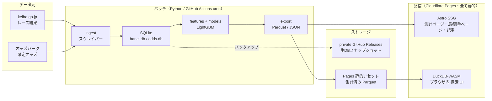

# ばんえい競馬プロジェクト 技術方針

最終更新: 2026-08-06

## 0. 前提（確定事項）

| 項目 | 決定 |
|---|---|
| 公開範囲 | 一般公開サイト（独自ドメイン、SEO を重視する） |
| リポジトリ | **public** |
| **データ公開方針** | **スクレイピングした生データをそのまま表示・配布しない。公開するのは集計値・派生指標・分析結果のみ** |
| 初期スコープ | 過去データの分析・可視化 |
| 将来スコープ | 当日レースの予想（発走前オッズを使った EV 表示） |
| 言語 | データ処理・ML は Python、画面は TypeScript |

このうち **データ公開方針が構成を大きく単純化している**（→ §3.4）。生データを出さない以上、個別レースの着順表ページは作らない。結果としてページ数が 42,000 → 約 6,000 に減り、SSR もデータベースも不要になった。

移行元: `/home/shimomo/github/banei/banei`（Git 管理外のスクリプト群）
移行先: このリポジトリ `banei-keiba/banei-keiba`

### 現状の資産

- `scraper.py` — keiba.go.jp からレース結果を収集 → `banei.db`
- `odds_scraper.py` / `combo_odds_scraper.py` — オッズパークから確定オッズ → `odds.db`
- `experiment.py` — LightGBM 勝率モデル + バックテスト
- `ev_backtest.py` — 実オッズを使った EV バックテスト
- `dashboard.html` — 静的 HTML のダッシュボード

### データ規模（2026-08-06 時点）

| | 件数 | 備考 |
|---|---:|---|
| races | 33,493 | 2007-04-27 〜 2026-08-03 |
| results | 307,849 | |
| payouts | 331,427 | |
| odds（単複） | 76,477 | 8,277 レース分 |
| combo_odds | 6,178 | **ほぼ未取得**。三連単は 1着馬ごとに 1 リクエスト必要で重い |
| 開催日 | 2,905 | 年間 約150〜165日 |
| 馬 | 5,501 | |
| 騎手 / 調教師 | 51 / 47 | |
| ファイルサイズ | 92MB | `banei.db` 80MB + `odds.db` 12MB |

**この「小ささ」が方針の中心**。年間増分は約 1,700レース / 15,000行。DB サーバーを常時稼働させる必要はどこにもない。

---

## 1. 全体方針（3行）

1. **生データは公開側に渡さない**。Python の `export` を唯一の関門にし、そこを通った集計値だけがサイトに出る。この制約が結果的に構成を最も単純にしている。
2. **Python はデータ層に閉じる**。収集・特徴量・学習・推論はすべて Python のまま。画面は TypeScript。両者の境界は「生成されたファイル（Parquet / JSON）」だけ。
3. **サーバーもデータベースも持たない**。Cloudflare Pages（全ページ静的）だけで配信し、ドメイン代以外は実質 0 円。

---

## 2. アーキテクチャ



**生データは C1（非公開リポジトリ）で止まる。** 公開側に流れるのは B4（export）が集計した派生指標だけ、という一方通行を構造で担保する。

### レイヤごとの責務

| レイヤ | 技術 | 責務 |
|---|---|---|
| 収集 | Python (requests + BeautifulSoup) | HTML → SQLite。冪等・再開可能 |
| 保存（正） | SQLite | 唯一の真実。Git 履歴には入れない（非公開リリースアセットにスナップショット） |
| 変換・学習 | Python (pandas + LightGBM) | 特徴量生成、学習、バックテスト、推論 |
| エクスポート | Python → Parquet / JSON | **集計して**画面が読む形に固める。ここが Python と TS の唯一の境界であり、生データ／公開データの関門 |
| 配信データ | Pages 静的アセット | 集計済み Parquet のみ（探索 UI 用） |
| 画面 | Astro (TypeScript) | 全ページ SSG。アイランドで部分的にインタラクティブ |

---

## 3. 技術選定と根拠

### 3.1 データ層は Python 据え置き（変更しない）

LightGBM・pandas・scikit-learn のエコシステムに代替はない。`experiment.py` の特徴量生成（過去成績を `shift` で厳密に因果化する処理）は既に本質的な資産であり、書き直す理由がゼロ。

整備するのはコードの品質面だけ:

- `uv` でパッケージ管理（`pyproject.toml`）、スクリプトの寄せ集めから `src/banei/` パッケージへ
- 特徴量生成・学習・バックテストの再現性（乱数シード固定、モデルのバージョン管理）
- テスト（パーサに対するゴールデンテストが最重要 — サイト側の HTML 変更を検知する）

### 3.2 画面は Astro（TypeScript）

**Streamlit / Dash を公開サイトに使わない理由:**

| 論点 | Streamlit の問題 |
|---|---|
| SEO | クライアント描画で URL がページに対応しない。検索流入がほぼ取れない |
| 表示速度 | 常時稼働サーバーが必要。無料枠はスリープするため初回表示が数十秒 |
| コスト | 常時稼働 = 月額課金。静的配信なら 0 円 |
| デザイン | 既存 `dashboard.html` の水準を Streamlit で維持するのは無理がある |

一般公開サイトという前提では、この 4 点すべてが致命的。

**Next.js ではなく Astro を選ぶ理由:**

- コンテンツ主体のサイトで、デフォルトで JS を 1 バイトも配信しない → 表示が速く、SEO に効く
- MDX で「馬場水分と勝ちタイムの関係」のような**解説記事**が書ける。これは長期的に検索流入の柱になる
- アイランド構成で、グラフや探索 UI の部分にだけ React/Svelte を差し込める
- 全ページ静的で足りるが、将来 SSR が必要になっても Cloudflare アダプタでページ単位に混在できる（逃げ道が残る）

Next.js は「アプリ」寄り、Astro は「サイト」寄り。本件は明確に後者。

**なお、自分用の探索には Streamlit や marimo をローカル専用で使うのはアリ。** 公開系と分けて `tools/` 配下に置く。両者を兼用しようとすると必ず破綻する。

### 3.3 ホスティングは Cloudflare

全ページ静的になったので選択肢は広がったが、それでも Cloudflare を採る。

| 候補 | 評価 |
|---|---|
| **Cloudflare Pages** | **採用。** ①帯域の従量課金がない ②日本からのレイテンシが良い ③将来 SSR/D1/R2 が必要になっても同じ場所で足せる |
| GitHub Pages | 全静的なら成立するが、帯域 100GB/月 の上限があり、逃げ道（SSR・オブジェクトストレージ）もない |
| Vercel | Astro との相性は良いが、帯域が従量課金で、商用利用の線引きも気になる |
| Fly.io / Cloud Run | サーバーを持つ構成なら候補。本件は持たないので不要（Phase 5 の推論ジョブでのみ Cloud Run Jobs を使う） |
| VPS（さくら等） | 運用コストが人的にも金銭的にも見合わない |

**帯域が従量課金でないこと**が実質的な決め手。Parquet を静的アセットとして置き、CDN が Range リクエストに応じることで、Phase 3 の探索 UI がサーバーレスで成立する。

### 3.4 データ公開方針が構成を決める

「生データをそのまま出さない」という決定は、単なる注意事項ではなく**アーキテクチャそのものを単純化する**。

**何を出さないか / 何を出すか**

| 出さない（生データ） | 出す（派生指標） |
|---|---|
| 個別レースの着順表 | 馬の通算成績、勝率・連対率、条件別の傾向 |
| 全馬のオッズ一覧 | 人気別の的中率、オッズ帯ごとの回収率 |
| 払戻金の一覧 | 券種別の平均配当、分布 |
| 出走表の丸ごと転載 | モデルの勝率予測、EV（Phase 5） |
| 生データの Parquet 配布 | 集計済みテーブルの Parquet |

判断基準は「**そのページを全部集めれば元のデータベースが復元できてしまうか**」。復元できるなら生データの再配布に当たる。

**この決定がもたらす単純化**

前提が変わったので、当初検討した Cloudflare D1 + Workers SSR の構成は**採らない**。

- レース詳細ページ（33,493）と開催日ページ（2,905）は生データそのものなので**作らない**
- 残るのは 馬 5,501 + 騎手 51 + 調教師 47 + 分析軸・記事のページ ≈ **6,000ページ**
- 6,000 は Cloudflare Pages 無料枠（ファイル数 20,000 / ビルド 20分）に**余裕で収まる**
- → **全ページ SSG で成立する。SSR もデータベースも要らない**

結果として、動く部品が「Python バッチ」と「静的サイト」の 2 つだけになる。運用の壊れどころが減り、コストも障害点も下がる。D1 は将来ページ数が上限に近づいたときの逃げ道として覚えておけばよく、初期構成には入れない。

**探索 UI — Parquet + DuckDB-WASM**

条件を変えながらのクロス集計は、サーバーを介さずブラウザ内で完結させる。

- Python 側が**集計済み** Parquet を Pages の静的アセットとして置く。ブラウザの DuckDB-WASM が HTTP Range で必要な部分だけ読む
- 集計済みなので数 MB 程度に収まり、Pages の 1 ファイル 25MiB 制限に余裕で収まる（生データを出さない方針がここでも効いている）
- ここに置くのは「馬 × 条件別の集計」「日次・条件別の集計」といった粒度で、明細行は含めない
- サーバー費用ゼロ、同時アクセス数の心配もゼロ

**Python 側で担保する**

「何が公開されるか」を人間の注意力に依存させない。`src/banei/export/` を**唯一の出口**にし、そこを通ったものだけが Astro のビルド入力になる。明細行を出力しようとしたらテストで落とす。

### 3.5 当日予想（Phase 5）の扱い

学習済みモデルでの推論なので、エッジで動かす必要はない。

- 開催日のみ、数分間隔で「出走表 + 直前オッズ」を取得 → 推論 → JSON を配信 → 画面はそれを読むだけ
- 実行基盤は **Cloud Run Jobs**（GitHub Actions の cron は起動が数分〜十数分ずれるため、分単位の更新には不向き）
- LightGBM を ONNX 化して Workers 上で推論する案は、複雑さに見合わないので採らない

---

## 4. リポジトリ構成

モノレポ 1 本。Python と Web を分けるほどの規模ではなく、分けるとデータ契約の変更が 2 リポジトリにまたがって面倒になる。

```
banei-keiba/
├── pyproject.toml              # uv / ruff / pytest
├── src/banei/
│   ├── ingest/                 # scraper.py, odds_scraper.py, combo_odds_scraper.py の移植先
│   ├── db/                     # スキーマ定義・マイグレーション
│   ├── features/               # experiment.py の build_dataset 相当
│   ├── models/                 # LightGBM 学習・評価
│   ├── backtest/               # ev_backtest.py 相当
│   └── export/                 # 【公開データの唯一の出口】集計 → Parquet / JSON
├── tests/
│   ├── fixtures/               # 保存した HTML に対するパーサのゴールデンテスト
│   └── test_export_policy.py   # 公開物に明細行が混じっていないことを検証
├── web/                        # Astro
│   ├── src/pages/              # 全て SSG（集計ページ・馬/騎手ページ）
│   ├── src/content/            # MDX の解説記事
│   └── src/components/
├── tools/                      # 自分用の探索（marimo / notebook）。デプロイ対象外
├── data/                       # .gitignore。ローカルの .db 置き場
├── docs/
└── .github/workflows/
```

**`.db` を Git 履歴に入れないこと。** 80MB のバイナリを毎日コミットすると履歴が数か月で数 GB になり、clone が現実的でなくなる。非公開リポジトリのリリースアセットとして置く（`scripts/backup-db.sh`）。リリースアセットは git 履歴に含まれないため、日次で回してもリポジトリは肥大化しない。

---

## 5. 実行基盤

| ジョブ | 実行場所 | 頻度 | 内容 |
|---|---|---|---|
| 日次収集 | GitHub Actions cron | 毎日 JST 深夜 | scrape → 検証 → バックアップ → 集計 Parquet/JSON 出力 → Pages デプロイ |
| モデル再学習 | GitHub Actions | 週次 | 学習 → バックテスト → 指標が悪化していなければモデル更新 |
| 過去分バックフィル | ローカル手動 | 随時 | combo_odds の取得（重いので計画的に） |
| 当日推論（Phase 5） | Cloud Run Jobs | 開催日 数分間隔 | 出走表 + 直前オッズ → 推論 → JSON 配信 |

日次収集は「失敗しても翌日リトライで自動復旧する」設計にする（既存の `scraped_days` による取得済みスキップがそのまま活きる）。

---

## 6. 段階計画

各フェーズは「完了条件」を満たしたら次へ。並行させない。

### Phase 0 — 土台（1〜2日）

- [x] **WSL2 の開発環境整備（2026-08-06）** — 下記「環境」参照
- [x] `pyproject.toml` 作成、既存スクリプトを `src/banei/` へパッケージ化
- [x] ruff / pytest / GitHub Actions の CI
- [x] `data/` を gitignore、既存 DB を `data/` へ移行（全テーブル行数一致・integrity_check ok）
- [x] 初回コミット + リポジトリを public 化（2026-08-06）
- [x] `.db` を非公開リポジトリへ退避（2026-08-06）— 復元して内容ハッシュ一致まで検証済み

**Phase 0 完了。** 完了条件（clone した状態から `uv run banei scrape --help` が動く）を達成。

#### 移行時に整理したこと

- 3 ファイルに重複していた `Fetcher`（レート制限付き HTTP クライアント）を `banei/net.py` に集約
- スキーマ定義の重複を `banei/db/schema.py` に集約
- 5 つの独立スクリプトを `banei` サブコマンドに統合（`scrape` / `odds` / `combo-odds` / `backtest` / `backtest-ev`）
- `--since` の SQL 文字列連結をプレースホルダに変更
- ML 依存（LightGBM・pandas 等）を `ml` エクストラに分離。日次スクレイプの CI は `uv sync` だけで回り、依存インストールが軽くなる

#### まだ移行していないもの

- `dashboard.html`（静的ダッシュボード）— Phase 3 の配色・レイアウト参考として `web/` 側に取り込む予定。移行元ディレクトリを消す前に回収すること

#### 生データのバックアップ

退避先は **[banei-keiba/banei-db-backup](https://github.com/banei-keiba/banei-db-backup)（private）** の
リリースアセット。`scripts/backup-db.sh` が実行する。

```bash
./scripts/backup-db.sh          # 退避
./scripts/backup-db.sh --dry-run  # アップロードせず確認だけ
```

処理内容:

1. `VACUUM INTO` でスナップショットを作る（収集中でも一貫性が保たれ、断片化も解消される）
2. スナップショットに `integrity_check` を通す（壊れたものを退避しない）
3. `gzip -9` で圧縮（92MB → 22MB）
4. リリースアセットとして上げる

| リリースタグ | 用途 |
|---|---|
| `latest` | 毎回上書き。復元はここから取る |
| `snapshot-YYYY-MM` | 月内は上書き。取り違え時の巻き戻し用 |

リリースアセットは git 履歴に含まれないため、日次で回してもリポジトリは肥大化しない。

復元:

```bash
gh release download latest --repo banei-keiba/banei-db-backup --dir data
gunzip data/banei.db.gz data/odds.db.gz
```

**退避先は private のままにすること。** 生データを含むため、public にすると §3.4 の方針が
壊れる。スクリプトは実行前に `isPrivate` を確認し、private でなければ中断する。

##### なぜ R2 ではないのか

当初は Cloudflare R2 を想定していたが、R2 はアカウントごとに有効化（checkout flow）が必要で、
その際に支払い方法の登録を求められる。無料枠（10GB / Class A 100万・Class B 1000万 req/月・
エグレス無料）で十分収まる規模ではあるが、カード登録を避けて private リリースアセットを選んだ。

データは 22MB と小さく、日次で 4 アセットを差し替えるだけなので GitHub Releases で不足はない。
将来 R2 を有効化した場合は `scripts/backup-db.sh` のアップロード部分だけ差し替えれば移行できる。

復元:

```bash
npx wrangler r2 object get banei-private/latest/banei.db.gz --file data/banei.db.gz --remote
gunzip data/banei.db.gz
```

#### 環境（2026-08-06 時点・インストール済み）

#### 環境（2026-08-06 時点・インストール済み）

| ツール | バージョン | 備考 |
|---|---|---|
| Node.js | 24.19.0 (LTS) | NodeSource 経由。Ubuntu 26.04 の apt 版は 22 系 |
| npm | 11.17.0 | |
| uv | 0.12.1 | `~/.local/bin` |
| gh | 2.97.0 | GitHub 公式 apt リポジトリ |
| Python | 3.14.4 | |

**PATH の注意**: Windows 側の `/mnt/c/Program Files/nodejs/` が PATH に残っているが、Linux の `/usr/bin` が先に来るため `node` / `npm` は Linux 版が使われる。

**依存の動作確認済み**: Python 3.14.4 + LightGBM 4.7.0 / pandas 3.0.5 / pyarrow 25.0.0 / scikit-learn 1.9.0 がすべて wheel で導入でき、既存 `experiment.py` の `build_dataset()` が pandas 3.0 系でも変更なしで通ることを確認（305,003行 × 44列）。移行時の互換性ブロッカーはない。

### Phase 1 — パイプライン自動化（2〜3日）

- [x] パーサのゴールデンテスト（`tests/test_golden.py` / 27 ケース）
- [x] データ検証 `banei validate`（`tests/test_validate.py` / 21 ケース）
- [x] 日次 cron ワークフロー `.github/workflows/daily.yml`
- [x] オッズのバックフィルワークフロー `.github/workflows/backfill-odds.yml`
- [ ] `BACKUP_TOKEN` シークレットの登録 ← **ユーザー操作待ち**
- [ ] 1 週間の無人稼働を確認

**完了条件**: 1 週間、手を触れずにデータが伸び続ける

#### 検証の閾値は実データから導出している

推測で閾値を置くと正常データで誤検知する。19 年分（33,493 レース / 307,849 行）を集計して
決めた。特に以下は**推測していたら間違えていた**もの:

| 事実 | 誤りやすい思い込み |
|---|---|
| **同着がある**（1着が複数のレースが 37 存在） | 「着順は一意」と仮定して異常検知すると誤検知する |
| **取消・除外馬は `win_odds` が NULL**（617 行） | 「オッズは必ずある」と仮定すると誤検知する。異常なのは*レース内の全馬*が NULL のときだけ |
| **中止で `n_races=0` の開催日が 6 日ある** | 「開催日には必ずレースがある」は成り立たない。警告止まりにする |
| **開催間隔は最大 34 日**（長期休催） | 「毎週開催」を前提に鮮度チェックすると誤検知する。閾値は 45 日 |
| 1 日のレース数は 3〜12、出走頭数は 4〜10 | 「常に 10〜12 レース」ではない |

#### ゴールデンテストのフィクスチャは合成 HTML

実ページの HTML をコミットすると生データの再配布に当たる（§3.4）ため、**構造だけを
忠実に再現した合成 HTML** を置いている。表記形式（`性齢` が `牝 3`、`馬体重（増減）` が
`984 (44)`、騎手名の減量マーク `☆` など）は実ページ 1 件を取得して確認し、その際
パーサ出力が DB の内容と完全一致することも検証済み。

**限界**: 保存 HTML では相手サイトの構造変更は検知できない（実 HTML を置いても同じ）。
上流の変更は日次ワークフローの `banei validate` で検知する — パースが壊れれば取得件数が
落ち、不変条件に引っかかる。

#### 日次ワークフローの構成

```
バックアップから DB を復元 → scrape（前月〜当月）→ odds（直近30日）
  → validate → 増分表示 → バックアップ
```

- 実行は JST 02:00（UTC 17:00）。レース確定は JST 21 時頃なので余裕をみている
- `concurrency: daily-ingest` で直列化。DB を復元→更新→書き戻すため、並行実行すると更新が失われる
- **検証を通ったデータだけを書き戻す**。壊れたデータでバックアップを上書きしない
- 前月から見るのは月初の取りこぼし対策。取得済みの日はスキップされるので追加コストは月次スケジュール頁 1 リクエストだけ

#### オッズのバックフィルを日次から分離した理由

2026-08 時点で確定オッズ未取得が **25,216 レース**ある。1 リクエスト/秒なので全部で約 7 時間
かかり、GitHub Actions のジョブ上限 6 時間を超えるうえ、相手サイトに毎晩その負荷をかけることになる。

そのため `banei odds` に `--since` と `--limit` を追加し、

- 日次は `--since`（直近 30 日）で新しいレースだけ
- 過去分は `backfill-odds` ワークフロー（手動実行・既定 3,000 件）で少しずつ

に分けた。3,000 件/回なら約 50 分で、9 回ほど回せば埋まる。日次が安定してから schedule を
足すか判断する。

#### 必要なシークレット

日次ワークフローは非公開リポジトリ [banei-db-backup](https://github.com/banei-keiba/banei-db-backup)
の DB を読み書きするため、そのリポジトリへのアクセス権を持つトークンが要る。
`GITHUB_TOKEN` は他リポジトリにアクセスできないので代用不可。

`banei-keiba/banei-keiba` の Settings → Secrets and variables → Actions に
`BACKUP_TOKEN` を登録する。fine-grained PAT で、対象を `banei-keiba/banei-db-backup` に絞り、
権限は **Contents: Read and write** のみでよい。

### Phase 2 — 公開サイト最小版（1週間）

- [ ] Astro + Cloudflare Pages、独自ドメイン + SSL
- [ ] トップ、主要な集計ページ（10〜20ページ程度の SSG）
- [ ] 解説記事 1 本（例: 馬場水分と勝ちタイムの関係 — 既に SQL がある）
- [ ] `export` の公開ポリシーテストを先に書く（明細行が出ないことを保証してから公開する）
- [ ] 免責事項・データ出典の明記

**完了条件**: URL を人に共有できる状態

### Phase 3 — 探索 UI（1週間）

- [ ] Python 側で集計済み Parquet 出力 → Pages 静的アセット
- [ ] DuckDB-WASM でブラウザ内クロス集計（条件・期間・騎手などでフィルタ）
- [ ] グラフの設計を統一（既存 `dashboard.html` の配色を踏襲する価値あり）

### Phase 4 — 馬・騎手ページ / SEO（1週間）

- [ ] 馬 5,501 + 騎手 51 + 調教師 47 の**集計ページ**を SSG（レース結果ページは作らない）
- [ ] 各ページの中身は通算成績・条件別傾向・相性など派生指標のみ
- [ ] sitemap、構造化データ、内部リンク

検索の裾を取りにいくのはここ（「ばんえい 〇〇（馬名）」等）。生データ転載サイトとの差別化は、むしろ**集計・分析の質**で行う — 着順表を並べても同じことをしている先行サイトに勝てない。

### Phase 5 — 当日予想

- [ ] 出走表スクレイパー（未着手 — 現状は結果のみ）
- [ ] リアルタイムオッズ取得
- [ ] Cloud Run Jobs で推論 → JSON → 画面
- [ ] 予想の成績を公開で記録する（後付けで良く見せない仕組み）

### 並行してやる（フェーズ非依存）

- [ ] `combo_odds` のバックフィル。現状 6,178 行しかなく、三連単・三連複の分析ができない。1req/s で計画的に

---

## 7. コスト試算

| 項目 | 月額 |
|---|---|
| Cloudflare Pages | 0 円（無料枠内） |
| バックアップ（private GitHub Releases） | 0 円 |
| GitHub Actions | 0 円（public リポジトリのため無制限） |
| ドメイン | 年 1,000〜2,000 円 |
| Cloud Run Jobs（Phase 5） | 数十円〜 |

**実質ドメイン代のみ。** これは「小さいデータ + 読み取り専用 + 静的配信」を貫いた結果であり、途中で常時稼働サーバーを導入するとこの前提が崩れる点に注意。

---

## 8. 制約と注意点

**技術的制約**

- Cloudflare Pages 無料プランはファイル数 20,000 / ビルドタイムアウト 20分。約 6,000ページなら収まるが、**ページ数は上限に対する残り枠として意識しておく**（レース結果ページを作る方針に戻すと即座に破綻する）
- GitHub Actions の cron は指定時刻から数分〜十数分ずれる。日次バッチなら無害だが、当日予想には使えない
- public リポジトリなので、**シークレットは必ず GitHub Secrets に置く**。`.env` をコミットしない仕組み（gitleaks 等）を CI に入れる

**運用上の注意**

- スクレイピングは 1req/s を維持し、User-Agent に連絡先を明記する。既存実装のインターバルとスキップ機構はそのまま守る
- HTML 構造の変更でパーサは必ず壊れる。ゴールデンテストと「取得件数の異常検知」を先に作っておく
- 移行時に `banei.db` / `odds.db` は必ずバックアップを取る（19年分の再取得は現実的でない）

**公開に伴う要確認事項（Phase 2 前に必須）**

- **生データの再配布を避ける方針は決定済み**（§0・§3.4）。その上で keiba.go.jp / オッズパーク の利用規約は Phase 2 前に一読しておく
- 出典を明記する（どのサイトのデータを、いつ時点で集計したものか）
- 予想を公開する場合、的中を保証しない旨と免責を明示する。射幸心を煽る表現（「必勝」「絶対」等）は使わない
- バックテスト結果を載せる際は、前提（確定オッズで買えた仮定、スリッページ未考慮 — `ev_backtest.py` の docstring に既に記載あり）を必ず併記する

---

## 9. まだ決めていないこと

| 項目 | 判断時期 |
|---|---|
| ドメイン名・サイト名 | Phase 2 の前 |
| 馬ページに「直近5走」のような明細を載せるか | Phase 4 の前。厳密に方針を守るなら載せず、集計のみにする |
| 記事コンテンツの方向性（分析ノート寄り / 予想寄り） | Phase 2 |
| 収益化の有無 | 当面なし。入れる場合は規約と表示方針に影響する |

---

## 10. まとめ

- **Python はやめない。** データ層で使い続ける。ただし「画面まで Python」はやらない
- **サーバーもデータベースも持たない。** 生データを公開しない方針により全ページ静的生成で成立するため、動く部品は「Python バッチ」と「静的サイト」の 2 つだけ
- **差別化は集計・分析の質で行う。** 着順表の転載では先行サイトに勝てないし、そもそもやらないと決めた
- **段階的に。** Phase 2（10ページの公開サイト）までは 2 週間程度で到達できる。馬・騎手ページの SEO や当日予想は、土台ができてからで遅くない
